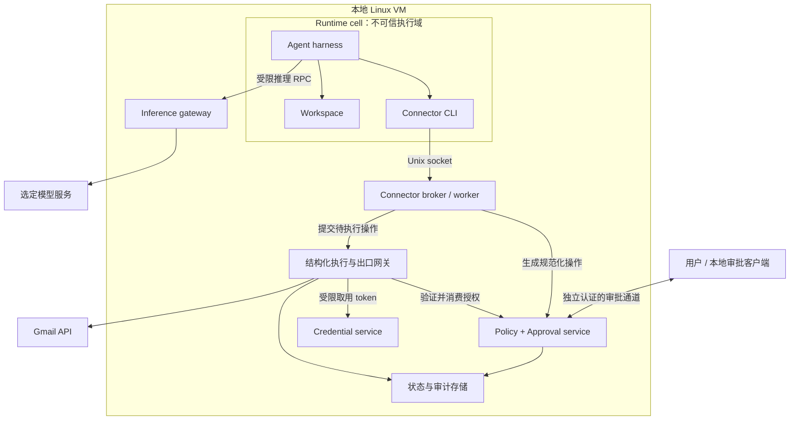

# 本地 Personal Agent Secure VM：设计与模块讨论稿

状态：架构提案与实现对照。M1–M4 的只读 Gmail 链路已运行；M5/M6/M7 的当前 MVP 已补齐凭证加密、独立审批与内核出口控制，见 [安全基础实现](docs/SECURITY_FOUNDATION.md)。下文仍包含尚未实现的目标设计，不应视为完整验收。M8 已部署真实 pi SDK agent 并通过 Codex 订阅模型及本地工具循环测试，见 [Pi 接入](docs/PI_AGENT.md)；发送与完整恢复暂缓。日期：2026-09-18。

## 1. 目标与难度判断

在本地运行个人助理，让它能够读取 Gmail、分析邮件、生成回复，并在明确授权后发送；即使 agent 被邮件中的提示注入诱导，仍限制其读取凭证、扩大权限和向外发送数据的能力。

可行性判断：一个用途受限的版本可实现，难度中高；开放任意 CLI、浏览器和联网能力后，难度显著增加。最难的不是启动 VM，而是让所有产生外部影响的路径都经过同一授权边界，并确保批准的内容就是最终执行的内容。

以下是工程估算，不是 Meta 数据或交付承诺。假设一名熟悉 Linux、后端和 OAuth 的工程师全职开发，先做单用户、单 Gmail 账户、不含浏览器和自动污点追踪的版本：

| 阶段 | 粗略投入 | 能证明什么 |
|---|---|---|
| 架构实验 | 1–2 周 | 隔离环境、模拟连接器、审批闭环能够运转 |
| Gmail MVP | 累计 4–8 周 | 测试账户中可读邮件、生成内容、审批发送，并通过核心负向测试 |
| 日常使用硬化 | 再投入 1–3 个月 | 恢复、审计、升级、异常路径和攻击测试较完整 |
| 通用个人助理平台 | 数月以上，宜多人协作 | 多连接器、浏览器、复杂网络策略及持续安全维护 |

OAuth 应用配置与验证、现有 harness 的兼容性、VM 网络限制及外部审查，都会改变工期。功能跑通不等于已经达到可处理所有敏感数据的安全水平。

## 2. 参考依据与本方案的边界

Meta 文章明确披露：runtime cell 使用 systemd-nspawn；容器 root 映射为宿主非特权用户；内置连接器的 CLI 与外部 worker 分离；Unix socket、SO_PEERCRED 与 ACL 用于跨边界通信；authd 管理凭证，Sentinel 授权操作与出口，并在出口替换 surrogate token。文章未提供完整配置、协议和实现源码。[1]

本文后续内容是我们自己的设计提案，不能视为 Muse 的真实实现。尤其是数据结构、状态机、UID、目录和里程碑均由本项目拟定。我们先保留隔离、最小权限、独立审批这几个原则，不追求完整复制其实现。

## 3. 威胁模型

### 3.1 假设攻击者能做什么

- 控制邮件、附件和工具返回的部分内容。
- 诱导模型产生错误的工具调用，甚至让 cell 内执行任意代码。
- 修改 cell 内可写的脚本、CLI、工作区文件，伪造请求参数。
- 反复调用允许暴露的接口，尝试重放批准、替换附件或转移数据。

设计时不能信任 cell 内程序声称的角色、风险等级、审批结果或任务目的。

### 3.2 信任什么

- 本地物理宿主的管理员、虚拟化层、Linux guest 内核。
- guest 内的策略服务、执行网关、凭证服务、审批通道及其依赖。
- 用户在独立审批界面中的操作。

这套设计不防本机管理员读取 VM 内存，不提供 Confidential VM 保证，也不承诺消除内核漏洞或所有侧信道。容器和安全服务共享 guest 内核；若发生 guest 内核级逃逸，内部边界可能一起失效。

### 3.3 必须建立的安全不变量

1. Cell 不包含 Google、模型服务的真实凭证。
2. Cell 无默认外网出口，也不能访问物理宿主、局域网和云元数据地址。
3. 外部服务调用只能通过受控、结构化接口。
4. 修改代码或直接构造 RPC 不能绕过服务端授权。
5. 批准与执行绑定；改变收件人、正文、附件或账户后必须重新判断。
6. 审批服务故障、身份不明、权限不匹配时拒绝执行。
7. 有副作用操作结果不明确时，不盲目自动重试。
8. 审批、凭证和安全策略的写入通道不暴露给 cell。

## 4. 部署拓扑与第一版范围

当前工作目录位于 macOS 用户目录。先按“macOS 开发机 + 本地 Linux VM”规划，实际宿主型号、架构和虚拟化工具在模块 M1 中确认。Linux 隔离配置在 guest 中运行。

本文的 guest host 指 Linux VM 内、runtime cell 外的环境，不是 macOS 物理宿主。



图中 E 是唯一 Gmail 网络执行者。第一版 worker 不直接取真实 token，也不直接访问 Google。模型调用单独走 I，不允许借该接口指定任意 URL。

MVP 包含：单用户、单账户、邮件检索和读取、工作区内回复草稿、明确批准后发送、撤销权限、操作记录。暂不包含 Gmail 草稿同步、删信、自动归档、浏览器、任意网络代理、多账户、多用户、内核级污点传播。

## 5. 模块拆分

### M1：Linux VM 与可信基础

职责：提供受控 Linux 内核、systemd、磁盘、网络与启动环境。

已选择 Lima + VZ，运行固定镜像校验和的 Ubuntu 24.04 arm64 VM。初始配置为 4 vCPU、4 GiB 内存、30 GiB 稀疏磁盘；runtime cell 使用 Debian bookworm。宿主已确认为 Apple Silicon macOS。

约束：

- 不把整个 home、SSH agent、Docker socket 或系统凭证目录挂进 VM。
- 仅设置显式工作区导入导出路径；开发源码共享与生产运行分开。
- 管理入口不对局域网开放。宿主与 guest 间审批通信需有认证，不能仅凭“localhost”信任。
- 凭证磁盘与备份需加密；明确解锁密钥由谁保管。无人值守运行与人工解锁存在取舍。
- 快照恢复后失效旧会话和旧审批，避免恢复已经消费的授权。

验收：冷启动可重复；cell 无法访问宿主 home；VM 重启不导致防火墙短暂放开。

待讨论：运行器、CPU/内存配额、磁盘加密、是否需要无人值守。

### M2：Runtime cell 与进程身份

职责：承载 harness、脚本、工作区和子进程，限制对 guest host 的影响。

建议以 systemd-nspawn + user namespace 起步。systemd 提供私有用户映射、独立网络及 veth 配置，但启用几个选项不等于完整安全配置。[2]

本项目建议 harness 默认以容器普通用户运行；为其固定分配可管理的 guest UID/GID 映射。需要安装软件时，通过受控镜像构建完成，先不向 agent 开放容器 root。

拟定策略：只读基础 rootfs、独立可写 workspace、受限临时目录；去除不需要的 capabilities；禁止访问宿主 PID、设备、管理 socket；逐项验证 syscall 过滤与 Python/Node 等工具的兼容性。使用 cgroup 限制进程数、CPU、内存与磁盘消耗。

验收：cell 内执行攻击测试，不能读取凭证目录、修改策略、调试外部服务或更改外层网络规则。所有子进程持续落在受限 cgroup 中。

待讨论：是否支持容器 root、持久化目录、动态依赖安装方式、现有 agent harness。

### M3：IPC、身份验证与连接器协议

职责：把 cell 的请求变成经过验证的结构化调用。

建议使用 Unix domain socket，协议先用带版本和长度限制的结构化消息。明确 framing、超时、并发和错误码；JSON 本身不提供消息边界。

服务端通过 SO_PEERCRED 获取内核提供的连接身份，再结合自己的服务映射做 ACL 判断。该机制证明对端进程身份，不证明二进制没有被修改，也不能证明用户批准了请求。[3]

注意：namespace 中观察到的 UID/PID 与外层不同；实现必须在目标环境实测。不要让请求中的 `role`、`worker_name` 或 `user_id` 替代内核身份。避免根据可复用 PID 做延迟鉴权。

接口按业务动词设计，例如 `mail.search`、`mail.read`、`mail.prepare_send`，不暴露 `execute_shell`、任意 URL 或任意 Authorization header。工作账户在可信侧绑定。

附件可用 FD 传递，但收到 FD 后需要验证类型和大小，并复制为可信侧不可变快照再计算哈希。仅传 FD 并不能防止原文件被其他进程修改。Linux 的 SCM_RIGHTS 可传递已打开文件引用。[3]

验收：伪造角色、畸形消息、超大输入、恶意路径、错误账户和未授权 socket 调用均被拒绝。

待讨论：实现语言、消息协议、每任务 socket 与共享 socket 的取舍。

### M4：Connector worker 与结构化执行网关

职责：把业务操作转换成允许的第三方请求。

建议第一版只实现 Gmail。worker 负责业务解析和准备操作；执行网关持有 Google API 适配器与受限网络出口。二者运行在不同受限服务身份下。

网关只接收经过授权的业务对象，自行决定 method、host、path 和认证方式，不执行 worker 提供的任意 HTTP 请求。服务端固定 API 域名，禁用不必要重定向，并限制响应与附件大小。

这是我们对第一版的简化：不实现通用 surrogate token 替换代理。由于 cell 和 worker 都不能直接发送 Google 请求，真实 token 只在网关短暂使用即可。将来若支持第三方通用 CLI，再评估 surrogate 方案及其域名、账户、操作、生命周期绑定。

验收：即使 CLI 被替换，仍只能调用允许的业务接口；即使 worker 提出其他账户或目标 URL，网关也拒绝。

待讨论：worker 是否按连接器拆进程；是否需要读、写网关进一步分离。

### M5：Credential service 与 OAuth 生命周期

职责：Google 账户绑定、token 保存与刷新、撤销，以及模型服务凭证隔离。

标准 Google OAuth 可通过用户授权取得 access token，符合条件时取得 refresh token；刷新、增量授权及撤销需作为完整生命周期处理。[4]

第一版先用测试 Google 账户。只读读取与发送权限分别申请；Google 定义了 gmail.readonly 与 gmail.send 等 scopes，最终选择按功能最小化，不默认申请完整邮箱权限。[5]

设计要求：

- OAuth 回调和 state 校验由可信服务实现；不让授权码经过 agent 工作区或日志。
- 密文存储与解锁密钥分开考虑，不能把密钥放在同一目录就宣称完成保护。
- 只有固定网关身份能请求对应 provider/account 的 access token；worker 和 cell 无取密钥接口。
- refresh token 不返回给网关；刷新由 credential service 执行，其网络权限仅覆盖认证服务所需路径。
- 断开账户后，同时撤销本地授权、清除缓存并尝试 provider 侧撤销；失败需清楚显示。
- 日志、异常、core dump 和调试工具不得记录 token。

验收：cell 环境变量、磁盘、命令行及工具结果中无真实 token；错误服务身份取 token 失败；过期与撤销路径可重复测试。

待讨论：本地密钥托管、OAuth 应用配置、自动解锁、是否引入现有 secret store。

### M6：Policy service 与人工审批

职责：唯一决定操作可否执行的服务。

第一版使用确定性规则：每个主体（connector 或模型调用）有 `auto`/`ask` 模式，默认 `auto` 按白名单自动签发一次性授权，`ask` 逐次审批；未知操作默认拒绝。模型可以提供解释，但不能签发授权、降低风险级别或代替用户点击确认。

可信侧产生规范化操作对象：

```json
{
  "version": 1,
  "action_id": "generated-by-trusted-service",
  "operation": "gmail.send",
  "account_id": "bound-account",
  "to": ["alice@example.com"],
  "cc": [],
  "bcc": [],
  "subject": "Re: 项目进展",
  "body_blob_id": "immutable-body",
  "attachments": [],
  "thread_id": "optional-thread",
  "expires_at": "server-assigned-time"
}
```

字段仅为提案。可信端应从固定规范编码计算内容哈希；审批绑定规范化对象、不可变正文和附件，而非 agent 提供的摘要。最终 MIME 从同一对象产生，所有会改变发送含义的邮件头也纳入约束。

建议状态机：

```text
PREPARED → PENDING_APPROVAL → APPROVED → EXECUTING → SUCCEEDED
                          ↘ DENIED       ↘ FAILED / UNKNOWN
               另有 EXPIRED / CANCELLED
```

授权消费与 EXECUTING 转移须原子完成。同一 action 只允许一个执行者；检查账户是否撤销、授权是否过期及对象是否一致。UNKNOWN 表示外部结果不确定，不能直接当作未发送重试。

审批客户端直接连接 policy service，显示账户、To/Cc/Bcc、完整正文与附件信息。用户点击提交给 policy service；聊天中一句“已经批准”没有效力。审批页面若是 Web，需处理会话认证、CSRF、Origin 校验及被其他页面访问本地服务的风险。

验收：改正文、换附件、重放批准、跨账户使用、过期批准、并发消费、重启恢复均不能扩大授权。

待讨论：先用独立终端审批还是本地 Web UI；读权限范围；后续是否支持任务级批准。

### M7：网络出口与数据外发

职责：保证绕过 connector 也无法外发。

第一版让 cell 无外部路由，只暴露必要 IPC；guest host 用网络 namespace 与防火墙约束服务。不能把 HTTP_PROXY 环境变量当安全边界，因为任意代码可以忽略它。

策略要覆盖 IPv4、IPv6、UDP、DNS、代理隧道及宿主/局域网地址。网关解析目的地址后需在实际连接时验证，防止 DNS 变化或重定向绕开限制。证书与 TLS hostname 验证必须开启。

仅允许 CONNECT 隧道不能检查 HTTPS 请求正文。第一版通过“结构化网关自己生成 HTTPS 请求”回避通用 TLS 解密代理的复杂性。将来加入任意浏览器流量时需要重新设计，不能直接把当前保证延伸过去。

不实现内核级自动 taint tracking；保守地把本任务所有用户内容视为敏感，外发通过明确业务策略。Linux 提供 BPF LSM 挂接机制，但这不是完整的数据流追踪系统，覆盖 IPC、共享内存、文件和进程继承需要另行设计验证。[8]

验收：直接 curl、裸 socket、IPv6、DNS、UDP 和访问 VM 网关等路径均不能绕过；代理或策略服务停止时不自动退回直连。

待讨论：是否需要公共资料下载；若需要，采用无用户数据的独立下载服务，导入后仍视为不可信内容。

### M8：Agent harness、模型推理与内容处理

职责：让模型完成任务，同时不赋予其安全决策权。

可复用现有 harness，但要确认其支持自定义工具、推理路由、暂停恢复及隐藏凭证；不能把已有产品的 tool approval 当成本项目唯一授权层。

第一版允许指定模型服务作为明确的数据接收方：邮件内容可能被发送用于推理，必须在使用前确定该信任边界。若要求内容绝不离机，应另选本地模型并重新评估能力和资源。

Inference gateway 固定 provider、模型和账户；限制请求大小、速率和允许的参数，拒绝任意 endpoint、额外回调、用户自选文件上传及远程工具。模型 API 也是出口，不能凭“这是推理”忽略外发风险。

输入中把邮件正文与用户指令分开。对验证码、登录链接等内容采用专门过滤；后续可引入独立分类器。分类器漏报时仍应依靠授权与网络边界限制影响。

验收：恶意邮件要求外传数据、伪造批准、读取 token 时，不能获得超出授权的系统能力；超量推理触发配额限制。

待讨论：模型与 harness；云推理是否可接受；内容过滤误报的用户处理方式。

### M9：状态、审计与恢复

职责：持久化任务、批准、执行结果和必要证据。

单用户第一版可采用由可信状态服务独占的 SQLite；不要让多个隔离服务都直接读写整个数据库。若后续有复杂并发、权限分离需求再比较 Postgres。凭证数据库独立管理。

建议记录 action ID、账户标识、调用身份、操作类型、策略版本、审批人、内容哈希、时间和 provider 返回的 ID。正文可在短期受控存储中供审批使用，不默认复制到普通日志。

日志对 cell 不可写，但这不意味着对管理员不可篡改。审计保留期限、用户删除与备份恢复要一并定义。

验收：断电、重启和回滚后无自动补发；UNKNOWN 状态仍可见；备份不含明文凭证；旧批准不可因恢复再次使用。

待讨论：保留期限、备份、附件快照清理、是否需要远端审计。

### M10：浏览器与更高级能力（后续）

浏览器不是普通 connector 的小扩展：页面脚本、登录 cookie、下载、表单提交和后台请求都会引入新的数据外发路径。

只有当 Gmail 闭环稳定后，再讨论独立 browser broker、受限操作接口、cookie 隔离、用户接管、提交审批，以及浏览器全部网络请求的控制。不能仅关闭任意 JS 执行就认为浏览器安全问题已经解决。

内核级污点追踪、多 agent 权限继承、多个用户、长期自动授权也分别立项，不混入第一版。

## 6. Gmail 任务完整流程（本方案）

1. 用户在可信客户端绑定测试 Gmail 账户；token 存入 credential service。
2. 用户提交“读 Alice 邮件并生成回复”的任务；读取范围由可信策略绑定。
3. Harness 在 cell 内调用 `mail.search`，CLI 经 Unix socket 提交结构化参数。
4. Broker 验证调用身份与参数；policy service 判断读取范围。
5. 执行网关用批准的参数构造 Google 请求，并从 credential service 获取短期 access token。
6. 返回结果经过内容处理后进入 cell；模型通过指定推理路径生成待办及回复草稿。
7. Agent 调用 `mail.prepare_send`；可信侧冻结收件人、邮件正文与附件快照。
8. 审批界面展示待发送的实际内容；用户批准后形成一次性授权。
9. 网关原子消费授权，并检查对象、账户和有效期；随后构造最终 MIME 并发送。
10. Gmail 返回结果后更新状态；只有明确成功才向用户报告“已发送”。

Google 的发送接口接收编码后的 MIME 消息，并支持发送现有草稿；回复线程还需符合相应线程与邮件头要求。[6] 本项目会用固定转换逻辑生成这些字段。

如果只是把分析结果展示给用户，第 7–10 步无需发生。若发送请求超时，保留 UNKNOWN；Google 接受操作与本地持久化无法组成一个原子事务，不能声称拥有天然 exactly-once 保证。

## 7. 最小安全验收矩阵

| 攻击或故障 | 预期结果 |
|---|---|
| 邮件诱导转发给攻击者 | 未经对应批准不得发送 |
| Cell 内寻找真实 token | 环境、文件和工具响应中不存在 |
| 修改 CLI 或自己写 RPC 客户端 | 服务端仍执行身份、参数和策略检查 |
| 伪造 worker / account 字段 | 不能切换可信身份或账户 |
| 审批后替换正文或附件 | 哈希/对象不匹配，拒绝执行 |
| 同一授权被并发执行 | 仅一个执行者能消费 |
| 发送后返回超时 | 标为 UNKNOWN，不自动再次发送 |
| 直接联网、DNS 或 IPv6 外发 | 网络层拒绝 |
| 请求私网、宿主或重定向目标 | 拒绝 |
| 策略服务或网关崩溃 | 不产生绕过路径 |
| 恢复旧 VM 快照 | 旧会话与批准失效，无自动补发 |
| 通过推理接口指定其他目标 | 拒绝自定义 endpoint 和旁路操作 |

先使用 fake provider 与 canary secret 做自动化测试，再用测试 Gmail 账户验证；不以真实主邮箱作为第一轮调试环境。

## 8. 实施顺序与阶段出口

| 顺序 | 工作 | 完成标志 |
|---|---|---|
| P0 | 确认威胁模型、云推理接受度、VM 方案、语言 | 关键假设形成决策记录 |
| P1 | VM + cell + 无外网 + IPC | 身份验证与基础隔离测试通过 |
| P2 | Fake connector + 策略 + 审批 + 状态机 | 重放、变更、并发、崩溃测试通过 |
| P3 | Credential service + Gmail 只读 | 测试账户可读；无凭证暴露 |
| P4 | 冻结发送对象 + 审批发信 | 精确审批与 UNKNOWN 恢复通过 |
| P5 | 接入真实 harness 与推理网关 | 恶意邮件端到端测试通过 |
| P6 | 备份、恢复、升级、配额与安全审查 | 有证据后再扩大使用范围 |

先证明边界，再增加工具功能。这样发现问题时可以判断是模型、业务代码还是隔离机制导致，而不是同时调试全部组件。

## 9. 后续逐模块讨论的固定模板

每次讨论一个模块，记录：职责、信任边界、身份、接口、授权规则、数据持久化、失败行为、替代方案、验收用例与最终决定。

建议首先讨论 M1/M2：本地 VM 怎么运行，以及 cell 允许什么能力。随后讨论 M3/M6：跨边界协议和授权对象。它们决定其他模块能否保持简单。

| 决策 | 结果 | 状态（2026-09-20） |
|---|---|---|
| 部署环境 | Lima + VZ，Ubuntu 24.04 arm64，macOS 宿主 | 已决定并部署 |
| Runtime | systemd-nspawn，普通用户进程，运行真实 Pi SDK | 已决定并通过隔离验收 |
| 开发语言 | 可信服务 Python 标准库；cell 适配器与桌面 Node/Electron | 已决定 |
| MVP 出口 | 结构化 Gmail 只读与固定推理网关（Codex 订阅） | 已决定；API-key 路径去留待决 |
| 凭证传递 | 不向 cell 提供 token；无通用 surrogate | 已决定 |
| 读取与写入授权 | 按主体的 auto（默认）/ask 模式、一次性消费、写入绑定目标修订 | 已实现；任务级范围待设计 |
| 发送授权 | 每封明确审批、对象冻结、一次性消费 | 设计保留，未实现（暂缓） |
| 审批客户端 | Electron 桌面可信控制面 + 终端 policy.sh | 已决定 |
| 状态存储 | policy 与 inference 各自独占 SQLite | 已决定 |
| 高级能力 | 浏览器、eBPF taint、多用户延后 | 已决定延后 |

## 10. 参考资料

以下链接分别支撑产品架构概述或相关原语；它们不验证本提案的端到端安全性。实现时应固定实际 Linux/systemd 版本，并以该版本行为做测试。

1. [Meta：How We Built Safety Into Muse](https://research.meta.ai/blog/security-and-safety-for-ai-agents-our-approach-with-muse)
2. [systemd.nspawn 配置文档](https://www.freedesktop.org/software/systemd/man/systemd.nspawn.html)
3. [Linux unix(7)：SO_PEERCRED 与 SCM_RIGHTS](https://man7.org/linux/man-pages/man7/unix.7.html)
4. [Google OAuth 2.0 Web Server Applications](https://developers.google.com/identity/protocols/oauth2/web-server)
5. [Gmail API scopes](https://developers.google.com/workspace/gmail/api/auth/scopes)
6. [Gmail：Create and send email messages](https://developers.google.com/workspace/gmail/api/guides/sending)
7. [Linux user_namespaces(7)](https://man7.org/linux/man-pages/man7/user_namespaces.7.html)
8. [Linux Kernel：LSM BPF Programs（机制参考，v5.16）](https://www.kernel.org/doc/html/v5.16/bpf/bpf_lsm.html)
